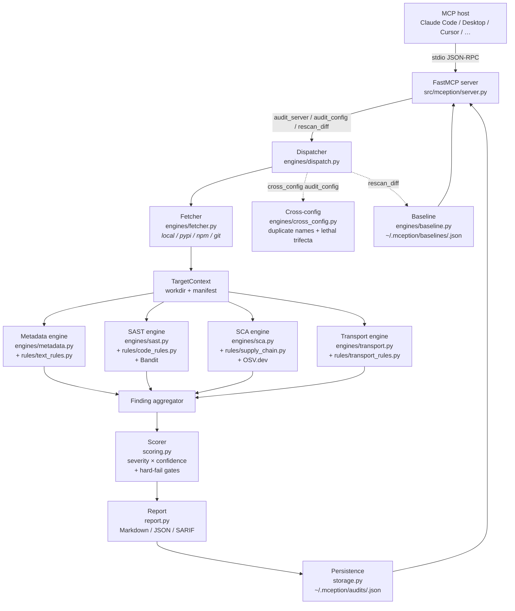

# mception

**An MCP server that audits other MCP servers for security risks.**

Give it a target — a local path, `pypi:…` package, `npm:…` package, `git+…`
URL, or an entire MCP client config — and mception returns a structured
report with per-finding scores, an overall score, and a final verdict:

| Verdict | When |
| --- | --- |
| ✅ `safe_to_use` | No High/Critical findings, score ≥ 85 |
| ⚠️ `use_with_caution` | Any High finding, or score 60–84 |
| ❌ `unsafe_to_use` | Any Critical, any Confirmed hard-fail (cred exfil, RCE, rug-pull, tool poisoning), or score < 60 |
| ❓ `inconclusive` | Couldn't fetch or introspect the target |

Reports render as **Markdown**, **JSON**, or **SARIF** (for CI / GitHub code scanning).

---

## Capabilities at a glance

- Fetch targets from npm, PyPI, git, or local directories (safe extraction, zip-slip defended).
- Static extraction of the MCP surface (tools / resources / prompts / server instructions) across **Python / TypeScript / JavaScript / Go / Rust** — **no code execution**.
- Five detection engines: metadata, SAST, SCA + supply chain, transport/auth, cross-config.
- 46 mception rules (Python / Node / Go / Rust) + OSV feed + optional Bandit passthrough.
- Deterministic scoring (same input → same ID → same verdict).
- Hash-pinned baselines with rug-pull diff (detect silent tool-definition changes).
- Whole-config audit: duplicate tool names across servers, lethal-trifecta composition.
- Ships as a wheel (`uvx`/`pipx`) and a multi-stage Docker image.
- No API keys required — optional LLM judge uses MCP `sampling/createMessage` so the host agent's own model does classification.

### Language support

| Language | Extract tools / resources / prompts | Handler SAST | Manifest → SCA |
| --- | :---: | :---: | :---: |
| Python | ✅ full AST | ✅ AST + Bandit | `pyproject.toml`, `requirements.txt` |
| TypeScript / JavaScript | ✅ regex (addTool / tool / addResource / addPrompt / positional / struct) | ✅ regex (cmdi / eval / SSRF / path / yaml / TLS) | `package.json` |
| Go | ✅ regex (`mcp.NewTool`, `mcp.Tool{}`, `NewResource`, `NewPrompt`) | ✅ regex (cmdi / SSRF / path / deser / bind) | `go.mod` |
| Rust | ✅ regex (`#[tool(...)]`, `.tool(name, desc)`) | ✅ regex (shell cmd / reqwest) | `Cargo.toml` |

---

## Architecture



**Design rules**

- **No exec on host.** Target code is never imported or executed — everything runs off AST/regex + manifest reads.
- **Fail-closed.** When fetch or introspection fails, the verdict is `inconclusive`, never `safe`.
- **Deterministic.** Audit IDs are `sha256(target|profile)[:16]`. Re-running the same audit overwrites the same file.
- **Every finding carries** a rule ID, CWE list (where applicable), OWASP MCP Top 10 mapping, and at least one reference URL.

---

## Risk coverage — full rule catalog

| Rule ID | Engine | Category | Detects |
| --- | --- | --- | --- |
| `MCP-TP-001` | Metadata | Tool poisoning | Invisible Unicode / bidi-control characters in text |
| `MCP-TP-002` | Metadata | ANSI injection | ANSI terminal escape sequences in text |
| `MCP-TP-003` | Metadata | Tool poisoning | Instruction-style phrases (`ignore previous instructions`, `do not tell the user`, …) |
| `MCP-TP-004` | Metadata | Credential exfil | References to secret paths (`~/.ssh/id_rsa`, `.env`, `.aws/credentials`) or env vars (`GITHUB_TOKEN`, …) |
| `MCP-PA-001` | Metadata | Param-name abuse | Parameters named `system_prompt` / `chain_of_thought` / `conversation_history` / … |
| `MCP-SH-001` | Metadata | Shadowing | Tool description names *other* tools (cross-tool reference) |
| `MCP-AA-001` | Metadata | Auto-approve bait | Privileged-sounding tool name with terse / reassurance-heavy description |
| `MCP-CMDI-001` | SAST | Command injection | `shell=True`, `os.system`, `os.popen`, `eval`, `exec`, concat-assembled commands |
| `MCP-PATH-001` | SAST | Path traversal | `open`/`Path.*` taking a tool param with no realpath-anchor guard |
| `MCP-SSRF-001` | SAST | SSRF | `requests`/`httpx`/`urllib` calls with tool-param URL and no host-allowlist guard |
| `MCP-DES-001` | SAST | Deserialization | `pickle.loads`, `yaml.load` without SafeLoader, `marshal.loads` |
| `MCP-EXF-001` | SAST | Credential exfil | Module-level `os.environ` iteration + outbound HTTP |
| `MCP-LOG-001` | SAST | Logging leak | Logger called with tool parameter, no redaction guard |
| `MCP-SQLI-001` | SAST | SQL injection | `cursor.execute(…)` with concat / format / f-string query |
| `BANDIT-*` | SAST | various | Optional Bandit passthrough — ~60 additional checks when `bandit` is installed |
| `MCP-SUP-001` | SCA | Supply chain | `package.json` install-time scripts (`preinstall` / `install` / `postinstall`) |
| `MCP-SUP-002` | SCA | Supply chain | Dependency name edit-distance 1–2 from a known-good package (typosquat) |
| `MCP-SUP-003` | SCA | Supply chain | Obfuscation — long lines with Shannon entropy > 4.8, `eval(atob(…))`, `Buffer.from` packed decode |
| `MCP-SUP-004` | SCA | Supply chain | `setup.py` top-level `os.system` / `subprocess.*` (import-time side-effects) |
| `MCP-SUP-005` | SCA | Supply chain | Floating version ranges (`^1.2.3`, `>=2.0`, `git+…`, `file:…`) |
| `MCP-SUP-006` | SCA | Supply chain | Missing lockfile when deps are declared (no integrity hashes) |
| `MCP-SUP-007` | SCA | Supply chain | Unexpected binary artifacts (`.exe`, `.dll`, `.so`, `.dylib`, `.node`, `.msi`) |
| `MCP-SUP-008` | SCA | Supply chain | Dependency no longer published (registry 404 — yanked / unpublished) |
| `MCP-SUP-009` | SCA | Supply chain | Very young dependency (<30 days old) |
| `MCP-SUP-010` | SCA | Supply chain | Rarely-used npm package (<100 downloads/month) |
| `OSV-*` | SCA | Dependency vuln | Batch query to [OSV.dev](https://osv.dev) — known CVEs, CVSS-graded severity |
| `MCP-PROV-001` | SCA | Provenance | Missing license (no manifest field, no `LICENSE`/`COPYING`) |
| `MCP-PROV-002` | SCA | Provenance | Declared repository URL unreachable / 4xx (phantom repo) |
| `MCP-AUTH-001` | Transport | Auth | Remote transport (`sse` / `streamable-http`) with no auth middleware visible |
| `MCP-AUTH-002` | Transport | Transport | Server binds to `0.0.0.0` / all interfaces |
| `MCP-AUTH-003` | Transport | Transport | TLS verification disabled (`verify=False`, `_create_unverified_context`) |
| `MCP-XCFG-001` | Cross-config | Shadowing | Duplicate tool name across multiple configured MCP servers |
| `MCP-XCFG-002` | Cross-config | Exfil sink | Lethal-trifecta composition (read-private server + write-egress server in same config) |
| `MCP-RP-001` | Baseline | Rug pull | Tool / resource / prompt added since pinned baseline |
| `MCP-RP-002` | Baseline | Rug pull | Tool / resource / prompt removed since pinned baseline |
| `MCP-RP-003` | Baseline | Rug pull | Description or params changed since pinned baseline |
| `MCP-LLM-001` | Metadata | Tool poisoning | LLM judge flagged text as suspicious (advisory, uses MCP sampling — off by default) |
| `MCP-LLM-002` | Metadata | Tool poisoning | LLM judge flagged text as malicious (advisory) |
| `MCP-META-001` | Dispatcher | Meta | Fetcher could not resolve target (→ inconclusive verdict) |
| `NODE-CMDI-001` | SAST (Node) | Command injection | `exec` / `execSync` / `spawn({shell:true})` with template literal or concat argument |
| `NODE-CMDI-002` | SAST (Node) | Command injection | `eval` / `new Function` / `vm.runIn*Context` / `vm.Script` |
| `NODE-SSRF-001` | SAST (Node) | SSRF | `fetch` / `axios.*` / `http.get` with dynamic URL and no host-allowlist hint |
| `NODE-PATH-001` | SAST (Node) | Path traversal | `fs.readFile/writeFile/open…` with dynamic path, no `path.resolve` + `startsWith` guard |
| `NODE-DES-001` | SAST (Node) | Deserialization | `yaml.load` / `yaml.parseDocument` without explicit SAFE schema |
| `NODE-AUTH-001` | SAST (Node) | Transport | `rejectUnauthorized: false` or `NODE_TLS_REJECT_UNAUTHORIZED=0` |
| `GO-CMDI-001` | SAST (Go) | Command injection | `exec.Command("sh", "-c", …)` or `exec.Command(var, …)` |
| `GO-SSRF-001` | SAST (Go) | SSRF | `http.Get/Post/Do` / `http.NewRequest*` without IP-allowlist hint |
| `GO-PATH-001` | SAST (Go) | Path traversal | `os.Open/ReadFile/Create/WriteFile` / `ioutil.*` without `filepath.EvalSymlinks` + prefix check |
| `GO-DES-001` | SAST (Go) | Deserialization | `yaml.Unmarshal` / `gob.Decode` / `xml.Unmarshal` |
| `GO-AUTH-002` | SAST (Go) | Transport | `http.ListenAndServe` bound to `:PORT` / `0.0.0.0` / `[::]` |
| `RUST-CMDI-001` | SAST (Rust) | Command injection | `Command::new("sh"|"cmd")` followed by `.arg("-c"|"/c")` |
| `RUST-SSRF-001` | SAST (Rust) | SSRF | `reqwest::get` / `reqwest::Client::new().get/post/request` without `IpAddr::is_private` hint |

---

## Install

### From the wheel (built in `dist/`)

```bash
pipx install dist/mception-0.1.0-py3-none-any.whl
mception                           # starts the stdio MCP server
```

### From source (editable, for development)

```bash
python -m venv .venv
# Windows
.venv\Scripts\activate
# macOS / Linux
source .venv/bin/activate

pip install -e ".[dev]"            # everything needed for tests
pip install -e ".[sast,sca]"       # runtime extras (Bandit, CycloneDX)
```

### Docker

```bash
docker build -t mception .
docker run --rm -i mception        # stdio MCP server in a container
```

### Via `uvx` (once on PyPI)

```bash
uvx mception
```

---

## Register with an MCP client

All examples assume `mception` is on your `PATH` (after `pipx install …` or
`pip install`). Replace with the Docker variant or an absolute path as needed:

```bash
# Docker form — works in every client, just substitute this for `mception`:
docker run --rm -i mception
```

### Claude Code (CLI)

```bash
# User scope — every project
claude mcp add --scope user mception -- mception
# Project scope — writes .mcp.json at the repo root (committed)
claude mcp add --scope project mception -- mception
# Local scope — current project, not committed (default)
claude mcp add mception -- mception

claude mcp list
claude mcp get mception
```

Or edit `.mcp.json` / `~/.claude.json` directly:

```json
{
  "mcpServers": {
    "mception": { "command": "mception" }
  }
}
```

Windows shim note: if `mception` resolves to a `.cmd` / `.bat`, wrap it —
`claude mcp add mception -- cmd /c mception`.
Docs: <https://code.claude.com/docs/en/mcp>

### Claude Desktop

Config file:

- macOS — `~/Library/Application Support/Claude/claude_desktop_config.json`
- Windows — `%APPDATA%\Claude\claude_desktop_config.json`

(Settings → Developer → Edit Config opens it.)

```json
{
  "mcpServers": {
    "mception": { "command": "mception" }
  }
}
```

Docs: <https://modelcontextprotocol.io/quickstart/user>

### Codex CLI (OpenAI)

Config file: `~/.codex/config.toml` (on Windows — `%USERPROFILE%\.codex\config.toml`).
Codex is experimental on Windows; WSL2 is recommended.

```bash
codex mcp add mception -- mception
```

Or edit the TOML directly:

```toml
[mcp_servers.mception]
command = "mception"
```

Docs: <https://developers.openai.com/codex/mcp>

### OpenCode

Config files:

- Global — `~/.config/opencode/opencode.json`
- Project — `opencode.json` at repo root (highest precedence)

Note OpenCode's shape is different: top-level key is `mcp`, the server needs
`type: "local"`, and `command` is an **array**.

```json
{
  "$schema": "https://opencode.ai/config.json",
  "mcp": {
    "mception": {
      "type": "local",
      "command": ["mception"]
    }
  }
}
```

Docs: <https://opencode.ai/docs/mcp-servers/>

### Cursor IDE

Config files:

- Global — `~/.cursor/mcp.json`
- Project — `.cursor/mcp.json` at repo root

Cursor requires an explicit `"type": "stdio"`.

```json
{
  "mcpServers": {
    "mception": {
      "type": "stdio",
      "command": "mception"
    }
  }
}
```

Docs: <https://cursor.com/docs/context/mcp>

### Windsurf (Codeium)

Config file: `~/.codeium/windsurf/mcp_config.json`.

```json
{
  "mcpServers": {
    "mception": { "command": "mception" }
  }
}
```

Docs: <https://docs.windsurf.com/windsurf/cascade/mcp>

### Continue (VS Code / JetBrains)

Create `.continue/mcpServers/mception.yaml` at the project root (or under
`~/.continue/mcpServers/` for user scope). MCP tools only activate in Agent mode.

```yaml
name: mception
version: 0.0.1
schema: v1
mcpServers:
  - name: mception
    type: stdio
    command: mception
```

Docs: <https://docs.continue.dev/customize/deep-dives/mcp>

### Cline (VS Code extension)

Config file (VS Code globalStorage for `saoudrizwan.claude-dev`):

- macOS — `~/Library/Application Support/Code/User/globalStorage/saoudrizwan.claude-dev/settings/cline_mcp_settings.json`
- Linux — `~/.config/Code/User/globalStorage/saoudrizwan.claude-dev/settings/cline_mcp_settings.json`
- Windows — `%APPDATA%\Code\User\globalStorage\saoudrizwan.claude-dev\settings\cline_mcp_settings.json`

(Replace `Code` with `Cursor` / `Windsurf` if running Cline in those forks.)

```json
{
  "mcpServers": {
    "mception": {
      "command": "mception",
      "args": [],
      "disabled": false
    }
  }
}
```

Docs: <https://docs.cline.bot/mcp/configuring-mcp-servers>

### Zed editor

Config file:

- macOS / Linux — `~/.config/zed/settings.json`
- Windows — `%APPDATA%\Zed\settings.json`

Zed uses `context_servers` (not `mcpServers`):

```json
{
  "context_servers": {
    "mception": {
      "command": { "path": "mception", "args": [], "env": {} }
    }
  }
}
```

Docs: <https://zed.dev/docs/ai/mcp>

### Sample configs

Starter snippets are in this repo:

- [`examples/mcp.json`](examples/mcp.json) — generic `.mcp.json` (Claude Code, Cursor, Windsurf, Claude Desktop share this shape).
- [`examples/docker.mcp.json`](examples/docker.mcp.json) — same, but launching mception via the Docker image.

---

## Usage — MCP surface

### Tools

| Tool | Signature | What it does |
| --- | --- | --- |
| `audit_server` | `(target, profile="standard", target_kind="local")` | Audit one MCP server. `target` forms: local path, `pypi:<pkg>`, `npm:<pkg>`, `git+https://…`. Profiles: `quick` (metadata only), `standard` (all static engines). |
| `audit_config` | `(config_path, profile="standard")` | Audit a whole MCP client config (`.mcp.json` / `claude_desktop_config.json`). Runs per-server audits, then applies cross-config rules. |
| `get_report` | `(audit_id, format="markdown")` | Render a persisted audit as `markdown`, `json`, or `sarif`. |
| `list_findings` | `(audit_id, severity_min="info", category=null)` | Filter findings by minimum severity / category, return JSON. |
| `list_audit_ids` | `()` | Enumerate every audit persisted on this host. |
| `predicted_audit_id` | `(target, profile="standard")` | Return the deterministic audit ID for a target without running it. |
| `rescan_diff` | `(target, target_kind=null)` | Compare the target's current MCP surface against its pinned baseline. First call creates the baseline; subsequent calls emit `MCP-RP-*` findings on drift. |
| `refresh_target_baseline` | `(target, target_kind=null)` | Accept the target's current surface as the new baseline (after reviewing a legitimate change). |

#### Arguments — every parameter explained

**`target`** *(string, required for most tools)* — what to audit. Accepted forms:

| Form | Example | Notes |
| --- | --- | --- |
| Local path | `C:\path\to\server` or `/opt/srv` | Absolute path to a directory or a single entry file. Nothing is fetched; content is scanned in place. |
| `pypi:<pkg>[==version]` | `pypi:mcp-server-git==1.0.2` | Downloads from PyPI into a temp dir; if no version, picks latest. |
| `npm:<pkg>[@version]` | `npm:@modelcontextprotocol/server-filesystem@0.6.0` | Downloads the tarball from the npm registry. |
| `git+https://…[#ref]` | `git+https://github.com/acme/srv#main` | Shallow-clones the repo. Respects `#branch`/`#tag`/`#sha`. |
| `docker:<image>[:tag]` | `docker:ghcr.io/acme/srv:1.2` | Metadata-only inspection; source not extracted. |

Non-local targets are blocked when `MCEPTION_OFFLINE=1`.

**`target_kind`** *(string, default `"local"` for `audit_server`, `null` for `rescan_diff`/`refresh_target_baseline`)* — forces the fetcher. Usually auto-detected from the `target` prefix; set explicitly only when a raw string is ambiguous. Accepts `local` | `npm` | `pypi` | `git` | `docker`.

**`profile`** *(string, default `"standard"`)* — engine set selector. See the table below: `quick` | `standard` | `deep`. Also used as part of the audit-ID hash, so two profiles against the same target produce two distinct reports.

**`config_path`** *(string, required for `audit_config`)* — absolute path to an MCP client config file (`.mcp.json`, `claude_desktop_config.json`, Cursor `mcp.json`, etc.). The file is parsed, each declared server is audited via `audit_server`, then **cross-config rules** run over the combined result:
- `MCP-XCFG-001` — duplicate tool names across different servers (shadowing hazard).
- `MCP-XCFG-002` — "lethal trifecta" composition (a config that grants private-data read **+** untrusted-content ingestion **+** external-send in one tool surface).

Remote HTTP/SSE server entries are logged and skipped (nothing to statically analyze).

**`audit_id`** *(string, required for `get_report` / `list_findings` / the `mception://report/{id}` resource / the `triage_checklist` prompt)* — the 16-char deterministic hash returned by `audit_server`. Can also be precomputed via `predicted_audit_id(target, profile)`. Enumerate all persisted IDs via `list_audit_ids()`.

**`format`** *(string, default `"markdown"`, for `get_report`)* — output renderer. `markdown` (human-readable, default), `json` (machine-parseable full report), or `sarif` (SARIF 2.1.0 for IDE / code-scanning ingestion, e.g. GitHub code scanning).

**`severity_min`** *(string, default `"info"`, for `list_findings`)* — lower bound on the severity filter. One of `info` | `low` | `medium` | `high` | `critical`. Findings **at or above** this level are returned.

**`category`** *(string, default `null`, for `list_findings`)* — optional category filter. Values come from `Category` in `findings.py`: e.g. `tool_poisoning`, `prompt_injection`, `supply_chain`, `credential_exfiltration`, `transport`, `rug_pull`, `cross_config`. `null` returns all categories.

**`ctx`** *(FastMCP `Context`, injected automatically)* — not user-supplied. The MCP host injects this; mception uses it only to call `sampling/createMessage` when the LLM judge is enabled.

#### Profiles

`profile` selects which engines run against the target. Defined in `src/mception/engines/dispatch.py`.

| Profile | Engines | When to use |
| --- | --- | --- |
| `quick` | Metadata only | Fast triage. Parses tool/resource/prompt names + descriptions, runs text rules (tool poisoning, prompt injection, shadowing) and the optional LLM judge. No source-code analysis, no manifest/OSV queries. Seconds per target — good for CI gates or bulk-scanning a registry. |
| `standard` (default) | Metadata + SAST + SCA + Transport | Full static audit. SAST walks `.py`/`.ts`/`.js`/`.go`/`.rs` for cmdi / SSRF / path-traversal / deserialization / credential exfil. SCA parses manifests, queries OSV, checks typosquats / lockfiles / licenses / unpinned versions. Transport checks bind-all / missing auth / TLS-off. This is the profile you want for "is this MCP safe to install?" |
| `deep` | Same as `standard` today | Reserved for future heavier passes (e.g. cross-file taint). Currently an alias — any value other than `quick` falls through to the standard engine set. |

Audit IDs are `sha256(target|profile)[:16]`, so the same target audited under two different profiles produces two distinct reports and won't collide on disk. You can bypass profiles entirely from Python by passing `engines=[...]` to `run_audit()`.

### Resources

| URI | What |
| --- | --- |
| `mception://about` | Version + one-line help. |
| `mception://report/{audit_id}` | Full report, Markdown-rendered. |
| `mception://baseline/{target}` | Pinned fingerprint for a target (tool/resource/prompt hashes). |

### Prompts

| Prompt | Purpose |
| --- | --- |
| `triage_checklist(audit_id)` | Walks the user through reviewing an audit report end-to-end. |

### End-to-end example

```text
> audit_server(target="pypi:some-mcp-package")

Audit: aud_7f3a...
Verdict: use_with_caution   Score: 72.0/100
Reason: Score 72.0 in caution band or high-severity findings present.
Findings: 4 (crit=0 high=1 med=2 low=1)
Full report: get_report('aud_7f3a...', format='markdown').

> get_report(audit_id="aud_7f3a...", format="markdown")
# mception audit — pypi:some-mcp-package
...
```

---

## Scoring model

Scoring is fully deterministic — identical input always produces identical output. No probabilistic ranking, no ML tie-breakers.

```
per_finding_penalty  = severity_weight × confidence_multiplier
category_penalty     = Σ per_finding_penalty   (capped at 120 per category)
score                = max(0, 100 − min(100, Σ category_penalty))
```

| Severity | Weight | | Confidence | Multiplier |
| --- | --- | --- | --- | --- |
| Critical | 100 | | Confirmed | 1.0 |
| High | 60 | | Likely | 0.7 |
| Medium | 25 | | Suspected | 0.4 |
| Low | 5 | | | |
| Info | 0 | | | |

### Verdict gates

1. Any engine reports `inconclusive` → verdict = **inconclusive**.
2. Any Confirmed finding in a hard-fail category (`command_injection`, `credential_exfil`, `rug_pull`, `tool_poisoning`) → **unsafe_to_use**.
3. Any Critical, or score < 60 → **unsafe_to_use**.
4. Any High, or score < 85 → **use_with_caution**.
5. Otherwise → **safe_to_use**.

See [`src/mception/scoring.py`](src/mception/scoring.py) for the exact implementation and [`tests/test_scoring.py`](tests/test_scoring.py) for the contract.

---

## Report formats

- **Markdown** — human-readable, renders in any client. Used by default in the `get_report` tool.
- **JSON** — `AuditReport` Pydantic model serialized. Good for programmatic consumers.
- **SARIF 2.1.0** — for CI / GitHub code scanning. Each finding becomes a `result` with severity, location, rule metadata, OWASP + CWE mappings.

```bash
# From a CI step (after installing mception):
mception-cli scan ./my-mcp-server --format=sarif > mception.sarif
# (CLI batch mode — planned; for now, invoke via the MCP protocol or a short Python script.)
```

---

## Configuration

All runtime configuration is via environment variables. Defaults are in `src/mception/config.py` (`Settings` model).

| Env var | Type | Default | Purpose |
| --- | --- | --- | --- |
| `MCEPTION_DATA_DIR` | path | `~/.mception` | Where audit reports and rug-pull baselines live. Two subdirectories are created on first use: `audits/` (one JSON file per audit ID) and `baselines/` (one JSON file per pinned target). Change this when you want per-project isolation, or to point multiple clients at a shared drive for team audits. Relative paths are resolved against the server's working directory. |
| `MCEPTION_OFFLINE` | bool | `0` | When `1`/`true`/`yes`/`on`, mception **blocks every outbound HTTP request**: OSV vulnerability lookups, PyPI / npm registry calls (age + download counts), git clones, Docker pulls, phantom-repo `HEAD` probes. Local-path targets still work fully. Use this for air-gapped installs or when auditing classified code. Expect more `inconclusive` verdicts and fewer SCA findings. |
| `MCEPTION_INTROSPECT_TIMEOUT` | int (seconds) | `60` | Hard cap per introspection attempt (fetcher + engine pipeline per target). Prevents a single malformed tarball or slow git clone from stalling a batch scan. Applies per-target, not per-audit, so an `audit_config` over 20 servers still has time to finish. Bump this to `300` for large monorepos or slow networks. |
| `MCEPTION_ENABLE_LLM_JUDGE` | bool | `0` | Opt-in LLM-assisted classification of ambiguous tool/resource descriptions. Emits rules `MCP-LLM-001` (suspicious) and `MCP-LLM-002` (likely malicious). **No API key required** — uses MCP `sampling/createMessage`, so the host agent's own model responds. **Advisory-only**: findings are `Confidence=Suspected` and capped at `High` severity, so the judge alone cannot flip a verdict to `unsafe_to_use`. Only runs on items that didn't already trigger a static rule. Silently skipped when the host client doesn't implement sampling (e.g. some non-Claude clients). |

### Boolean parsing

Any of `1` / `true` / `yes` / `on` (case-insensitive) → true. Everything else, including unset, → false. So `MCEPTION_OFFLINE=0`, `MCEPTION_OFFLINE=false`, and not setting the variable are all equivalent.

### Where the data lives

```
$MCEPTION_DATA_DIR/
├── audits/
│   └── <audit_id>.json       # one per audit; audit_id = sha256(target|profile)[:16]
└── baselines/
    └── <target_hash>.json    # pinned tool/resource/prompt fingerprints for rug-pull diff
```

Deleting a file under `audits/` is safe — it just forgets the report. Deleting under `baselines/` resets the rug-pull check for that target (the next `rescan_diff` will create a fresh baseline and report no drift).

### Changing env vars after you've already registered mception

Each MCP client stores the server's env vars in its own config file. After any
change you need to reload the server in the client (usually `/mcp` → reconnect,
or restart the app).

#### Claude Code

Either remove + re-add via CLI:

```bash
claude mcp remove mception -s user
claude mcp add --scope user mception \
  -e MCEPTION_ENABLE_LLM_JUDGE=1 \
  -e MCEPTION_OFFLINE=0 \
  -e MCEPTION_DATA_DIR=~/.mception \
  -- mception
```

Or edit the entry directly in `~/.claude.json` (on Windows:
`%USERPROFILE%\.claude.json`):

```json
{
  "mcpServers": {
    "mception": {
      "type": "stdio",
      "command": "mception",
      "args": [],
      "env": {
        "MCEPTION_ENABLE_LLM_JUDGE": "1",
        "MCEPTION_OFFLINE": "0",
        "MCEPTION_DATA_DIR": "~/.mception"
      }
    }
  }
}
```

#### Claude Desktop

Open Settings → Developer → Edit Config (or edit the file directly):

- macOS: `~/Library/Application Support/Claude/claude_desktop_config.json`
- Windows: `%APPDATA%\Claude\claude_desktop_config.json`

```json
{
  "mcpServers": {
    "mception": {
      "command": "mception",
      "env": { "MCEPTION_ENABLE_LLM_JUDGE": "1" }
    }
  }
}
```

#### Codex CLI

Edit `~/.codex/config.toml`:

```toml
[mcp_servers.mception]
command = "mception"
env = { MCEPTION_ENABLE_LLM_JUDGE = "1" }
```

#### OpenCode

Edit `~/.config/opencode/opencode.json` (or project `opencode.json`):

```json
{
  "mcp": {
    "mception": {
      "type": "local",
      "command": ["mception"],
      "environment": { "MCEPTION_ENABLE_LLM_JUDGE": "1" }
    }
  }
}
```

#### Cursor / Windsurf / Cline / Zed

These all use the `mcpServers` / `context_servers` blocks shown in [Register
with an MCP client](#register-with-an-mcp-client). Add an `env` object next to
`command`:

```json
"mception": {
  "command": "mception",
  "env": { "MCEPTION_ENABLE_LLM_JUDGE": "1" }
}
```

(For Zed, the env goes inside the nested `"command": { "env": {…} }` block.)

---

## Project layout

```
mception/
├── pyproject.toml              uvx-installable, optional deps [sast,sca,dev]
├── Dockerfile                  multi-stage slim image, stdio entrypoint
├── README.md                   this file
├── examples/
│   ├── mcp.json                sample MCP client config
│   ├── docker.mcp.json         sample config wiring docker image
│   └── demo_*/                 deliberately-bad sample servers for smoke tests
└── src/mception/
    ├── __init__.py             version
    ├── cli.py                  `mception` console-script entry
    ├── server.py               FastMCP server — tools / resources / prompts
    ├── findings.py             Finding / Severity / Confidence / Category / Evidence
    ├── scoring.py              deterministic scorer + verdict gates
    ├── report.py               Markdown / JSON / SARIF renderers
    ├── storage.py              audit + baseline persistence
    ├── config.py               env-driven settings
    ├── rules/
    │   ├── text_rules.py       metadata rules (TP / PA / SH / AA)
    │   ├── code_rules.py       SAST rules (CMDI / PATH / SSRF / DES / EXF / LOG / SQLI)
    │   ├── supply_chain.py     SCA rules (SUP / PROV)
    │   └── transport_rules.py  transport / auth rules
    └── engines/
        ├── base.py             Engine protocol + TargetContext
        ├── fetcher.py          local / npm / pypi / git fetchers (safe extract)
        ├── source_parse.py     AST + regex extraction of MCP surfaces
        ├── metadata.py         MetadataEngine — applies text_rules
        ├── sast.py             SASTEngine — code_rules + optional Bandit
        ├── sca.py              SCAEngine — supply_chain + OSV feed + registry signals
        ├── transport.py        TransportEngine — transport_rules
        ├── cross_config.py     Whole-config analyzer + cross-server rules
        ├── baseline.py         Fingerprint pin / diff / refresh
        └── dispatch.py         Orchestrator — fetch → engines → score → persist
```

---

## Extending

### Adding a metadata / text rule

1. Write a function in [`rules/text_rules.py`](src/mception/rules/text_rules.py) that takes a `TextContext` and yields `Finding` objects.
2. Call it from `MetadataEngine.run` in [`engines/metadata.py`](src/mception/engines/metadata.py).
3. Add a unit test in [`tests/test_text_rules.py`](tests/test_text_rules.py).

### Adding a SAST code rule

1. Write a function in [`rules/code_rules.py`](src/mception/rules/code_rules.py) that takes a `CodeContext` (tool-handler AST + parameter names) and yields `Finding` objects.
2. Register it in `SASTEngine.run` in [`engines/sast.py`](src/mception/engines/sast.py).
3. Add a unit test in [`tests/test_code_rules.py`](tests/test_code_rules.py).

### Adding a new engine

1. Implement the `Engine` protocol in [`engines/base.py`](src/mception/engines/base.py) (`name: str`, `async def run(ctx) -> EngineResult`).
2. Register it in `_default_engines` in [`engines/dispatch.py`](src/mception/engines/dispatch.py).

### Adding a finding category

Add to `Category` in [`findings.py`](src/mception/findings.py). Scoring is category-agnostic.

---

## Development

```bash
pip install -e ".[dev,sast,sca]"

python -m pytest -q              # 74 tests, runs in <1s
python -m ruff check src tests
python -m build --wheel          # produces dist/mception-0.1.0-py3-none-any.whl
docker build -t mception .
```

### Running the server directly for debugging

```bash
# Start the stdio MCP server; pair it with `npx @modelcontextprotocol/inspector` to poke at tools.
mception
```

---

## Limitations / non-goals

- **No dynamic / runtime fuzzing.** mception does not execute target servers or probe tool handlers live. Classic web-vuln probing (SSRF/CMDi/path traversal fuzzing) is intentionally out of scope for this release.
- **No target-server execution.** We never import or run the target. This keeps mception safe to run against unknown packages, at the cost of missing servers that register tools dynamically at startup.
- **No Docker-image target fetching.** `docker:<image>` targets are not pulled/extracted; only statically-parseable artifacts are scanned.
- **Node/TypeScript/Go/Rust SAST is regex-based, not AST-based.** Python has full AST taint-ish analysis; other languages use tuned regex patterns calibrated against published MCP exploits. Tradeoff: lower false-positive rate than naive SCA but more miss-prone than a tree-sitter pipeline. PRs welcome.

---

## License

MIT.
